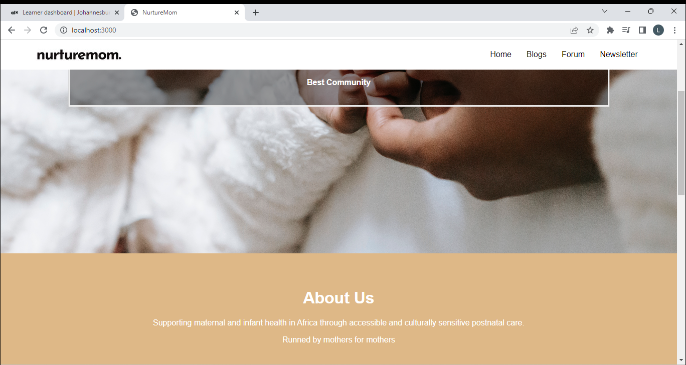
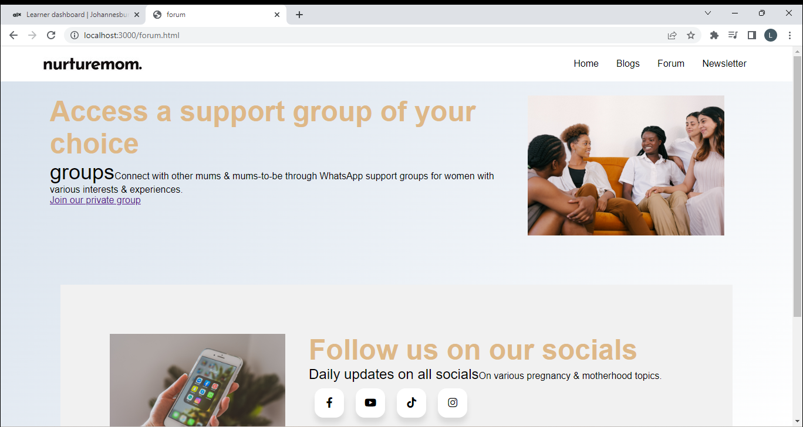

## NurtureMom

https://yoliyolanda.github.io/Research-and-Portfolio-Projetct-/public

This website is about supporting maternal and infant health in Africa through accessible and culturally sensitive postnatal care.

### Project Inspiration

NurtureMom was born out of personal experiences and a deep passion for supporting new mothers during the transformative postnatal period. As mothers ourselves, we understand the joys, challenges, and vulnerabilities that come with welcoming a new life into the world.
The NurtureMom Africa project aims to address the lack of accessible and culturally sensitive postnatal care for new mothers and their infants in Africa. Specifically, the project seeks to provide a platform that offers educational resources, community support, and access to healthcare professionals to improve maternal and infant health outcomes.

### Technology & Architecture

### Core algorithms and code snippet

Form validation: We used JavaScript to validate user input on forms, ensuring that the data entered meets specific criteria.
This algorithm can help enhance the user experience and prevent erroneous or malicious data from being submitted.
Discussion of process, collaboration and timeline
Our team held regular meetings and utilized [Github and Google meetings] to stay connected and track progress. We allocated specific responsibilities to each team member and encouraged open communication to address any roadblocks promptly.
Regarding the timeline, we set realistic milestones and regularly assessed our progress against them. This approach allowed us to adapt to unforeseen challenges and make necessary adjustments along the way.

### Authors

Cathrine Brando

https://www.linkedin.com/in/cathrine-brando

https://github.com/Cathyrt

Yolanda Mugabe

https://www.linkedin.com/in/yolanda-mugabe

https://github.com/Yoliyolanda
